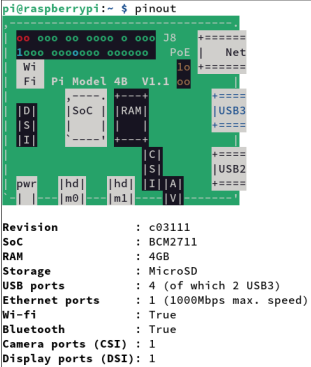
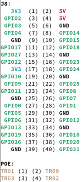

# Podstawy Internetu Rzeczy - Raspberry Pi

## Mapa pinów Raspberry Pi uzyskana poleceniem *pinout*
- (nn) - numery fizyczne
- GPIOnn - numery logiczne




## [config.py](raspberry_pi_program_testowy/config.py)
plik konfiguracyjny, który zawiera podstawowe 
informacje o mapowaniu portów I/O do obsługi urządzeń korzystających z funkcjonalności portów cyfrowych. 
Dokonuje on też inicjalizacji protów GPIO urządzeń obsługiwanych przez te porty.

Setup na podstawie wartości logicznych, nie fizycznych:
```python
GPIO.setmode(GPIO.BCM)
```

### Diody
| - - nazwa - - | wartość logiczna |
| :---: | :--------------: |
| led1 | 13 |
| led2 | 12 |
| led3 | 19 |
| led4 | 26 |

### Przyciski
| - - nazwa - - | wartość logiczna |
| :---: | :--------------: |
| buttonRed | 5 |
| buttonGreen | 6 |

### Encoder
| - - nazwa - - | wartość logiczna |
| :---: | :--------------: |
| encoderLeft | 17 |
| encoderRight | 27 |

### Buzzer
| - - nazwa - - | wartość logiczna |
| :---: | :--------------: |
| buzzerPin | 23 |

### ws2812pin
| - - nazwa - - | wartość logiczna |
| :---: | :--------------: |
| ws2812pin | 8 |

## L09

### [Zad1](L09/Zad1.py) - Regulacja jasności świecenia diody enkoderem

Napisz program, który pozwala regulować przy pomocy enkodera jasność świecenia diody LED 1
w module niebieskich diod świecących. Do obsługi enkodera wykorzystaj zdarzenia (events).

### [Zad2](L09/Zad2.py) - Odczyt parametrów środowiskowych z czujników DS18B20 oraz BME280 i ich wizualizacja poprzez diody WS2812

Napisz program, który wykorzystuje linijkę diod WS2812 do wizualizacji parametrów środowiskowych,
odczytanych z czujników DS18B20 oraz BME280, według schematu podanego przez Prowadzącego zajęcia.
Program może wykorzystywać interakcje przez konsolę tekstową i być sterowany poprzez przełączniki
przyciskane i enkoder.

## L10

### [Zad1](L10/Zad1.py) - Wyświetlanie na wyświetlaczu OLED wartości parametrów środowiskowych

Przygotuj program, który będzie odczytywał z czujnika BME280 wartości parametrów środowiskowych, 
które ten czujnik mierzy, i będzie wyświetlał je na ekranie OLED. Zilustruj wartości parametrów 
nie tylko jako wartości liczbowe, ale i za pomocą niewielkich symboli graficznych, na przykład, 
piktogramów.

### [Zad2](L10/Zad2.py) - Rejestracja użycia kart RFID

Przygotuj program, który będzie reagował na przyłożenie karty do czytnika RFID, identyfikował 
tą kartę i rejestrował dokładny czas jej przyłożenia do czytnika. Zadbaj, aby karta przyłożona 
jednokrotnie, była zarejestrowana jeden raz, niezależnie jak długo pozostawała przyłożona do 
czytnika. O fakcie zarejestrowania przyłożenia karty poinformuj sygnałem dźwiękowym
z buzzera i wizualnym, na przykład, diodami programowalnymi LED WS2812.
